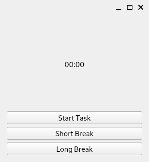
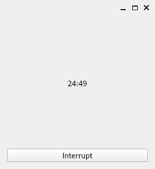

# Task Time Manager
A configurable pomodoro timer intended to be cross platform, leveraging PyQt6. The timer will track successful periods, breaks, etc. in a JSON file, specified in `config.toml`.

## Dependencies
- `python3` (tested with python 3.10.5)
- `poetry`
  - `python3 -m pip install poetry`

## Installation & Configuration
- `poetry install`
- Edit values in config.toml

## Usage
- `poetry run python3 ttm.py`

## Images
  
